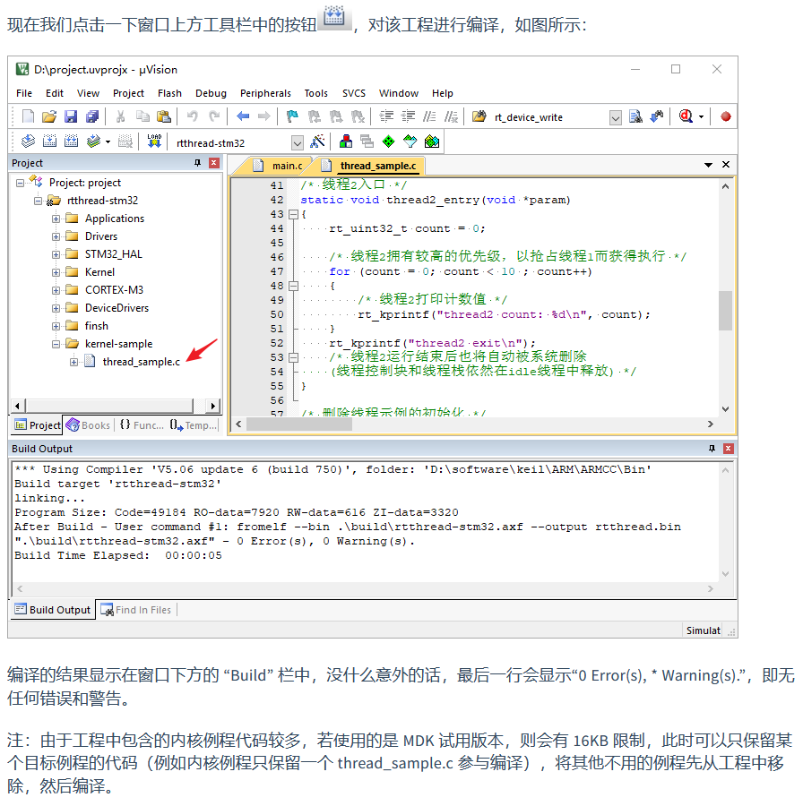

# Keil 模拟器使用 STM32F103

## 参考资料

[Keil 模拟器 STM32F103 上手指南](https://www.rt-thread.org/document/site/#/rt-thread-version/rt-thread-standard/tutorial/quick-start/stm32f103-simulator/stm32f103-simulator)

## 注意事项

在下图的步骤处有一点需要注意：

如果这一步什么也不做直接编译，是会报错的，官方文档中给出了一种解决方法：只保留某个目标例程的代码（例如内核例程只保留一个 thread_sample.c 参与编译），将其他不用的例程先从工程中移除，然后编译。

我们也可以使用另一种方法，把keil给破解了，网上keil的破解软件很好找，破解之后就可以不删除例程代码直接编译成功。
